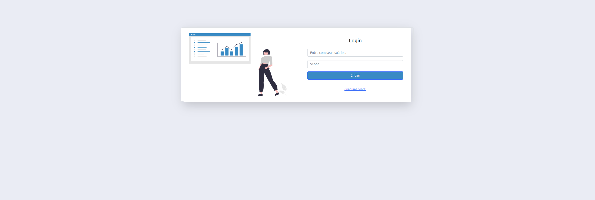
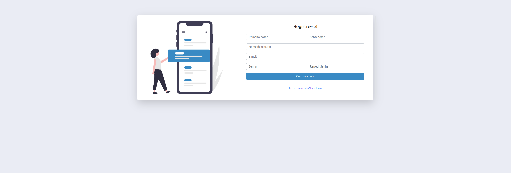
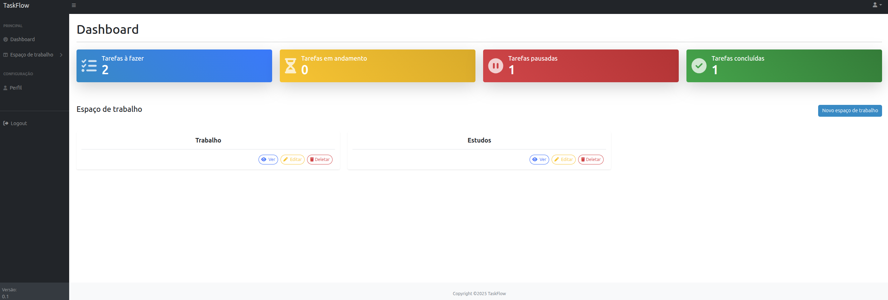
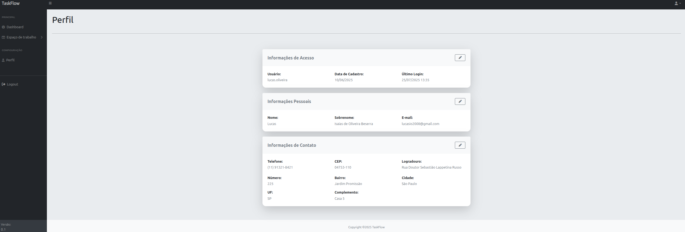
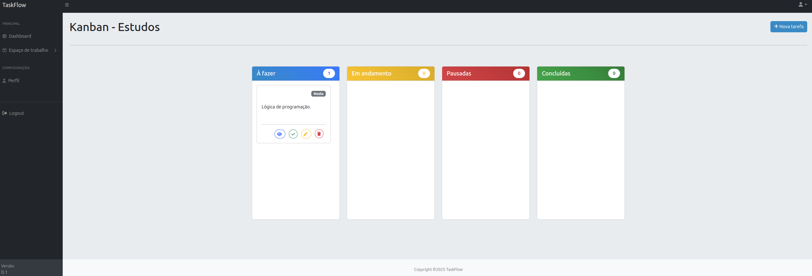
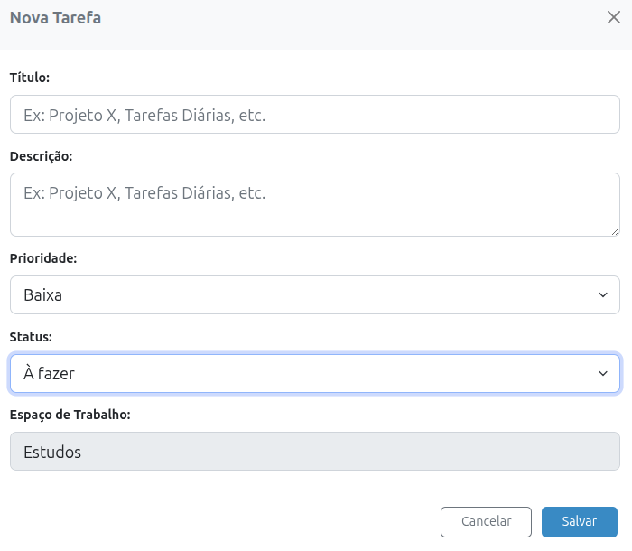
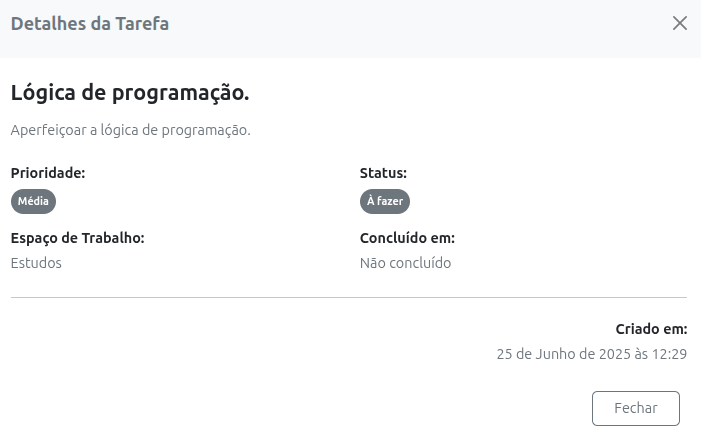
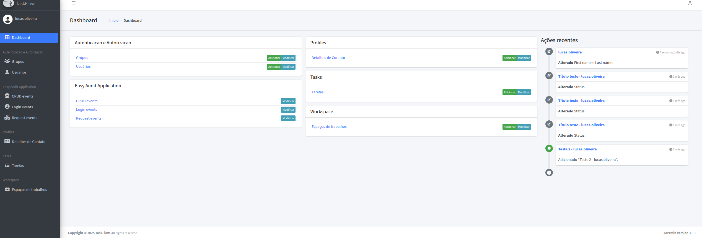

# TaskFlow.

Nesse repositório contém um projeto fullstack realizado o front-end com Html, Css, BootStrap 4, JavaScript e o back-end com Python e o framework Django.

O projeto consiste em um sistema para gestão de tarefas, o sistema permite gerenciar espaços de trabalho, tarefas e perfil.

<br>

<h2>Pré-requisitos</h2>

- [Docker](https://www.docker.com/) 

<br>

<h2>Clone</h2>

```bash
git clone https://github.com/lucas-ioliveira/task_flow.git
```

<br>

<h2 id="started">🚀 Primeiros passos</h2>

<p>Basta entrar no diretório do projeto e no terminal rodar o comando:</p> 


```bash
docker compose -f docker-compose.yml up -d --build
```

<p>Isso fará com que todas as dependências sejam instaladas e um container docker seja executado.</p>

<br>

<p>Verifique se o container está em execução com o comando:</p>

```bash
docker ps -a
```

<p>Acesse o container para a criação de um super usuário com o comando:</p>

```bash
docker exec -it task_flow_app bash
```

<p> criação de um super usuário com o comando:</p>

```bash
python manage.py createsuperuser
```

<p>Com um super usuário criado, é possível acessar o painel administrativo do sistema.</p>

<br>

<h2 id="routes">📍Rotas</h2>

<p>As páginas são acessíveis somente com o usuário autenticado, login e cadastro são de livre acesso.</p>

**Login**



<br>

**Cadastre-se**



<br>

**Dashboard**

<p>Ao realizar o login, o usuário é direcionado para o seu dashboard</p>



<br>

<p>Algumas informações relevantes são apresentadas, como o total de tarefas, espaços de trabalho criados e etc.</p>


<br>

**Perfil**

<p>Visualização geral do perfil</p>



<br>

**Tarefas**

<p>Visualização geral das tarefas</p>



<p>Adicionar tarefa</p>



<p>Detalhes da tarefa</p>



<br>

**Administração do sistema**

<p>Painel administrativo</p>

